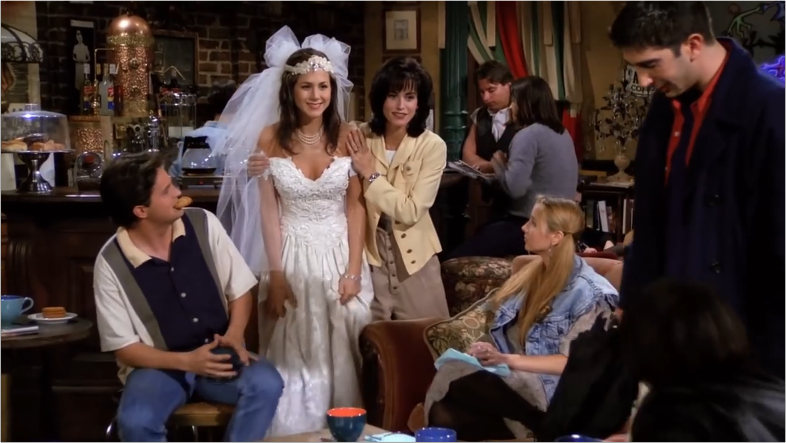
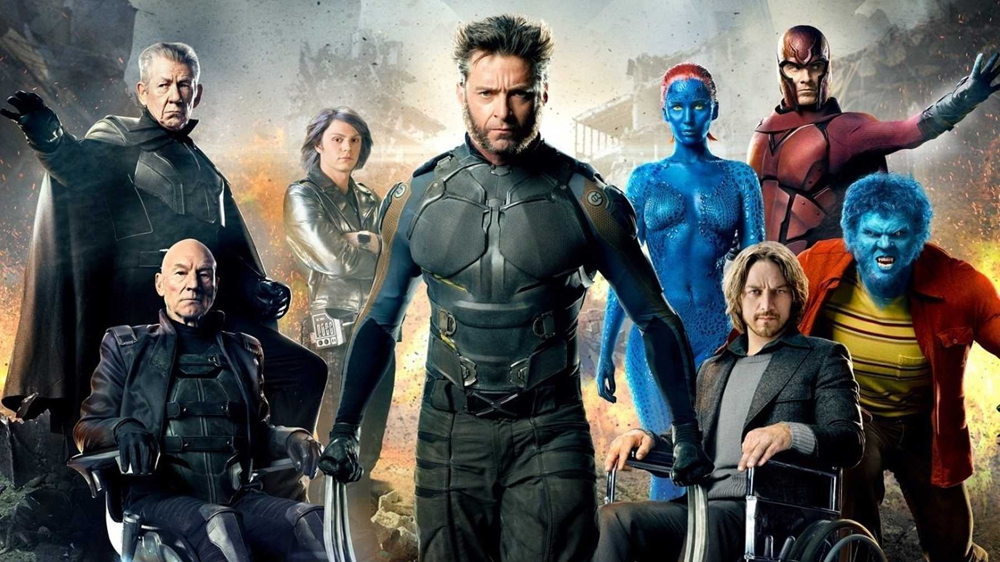

# WELCOME AYUSH SIR

My blog has been really enlighted by your presence. 

This post will make the blog trending in no time. To wish you on your birthday in this trying times on this platform...WOW!. <br>  The utility of the blog has been increased tenfold. 

Let the world know that while LSTM's and Embeddings are useful, nothing matters if the edium is not used to wish your dear friends.

That said, let's just jeep wishing you forever. 


```python
print("From everyone here at ADB - ")
while True:
    print("HAPPY BIRTHDAY AAYUSH")
```

Moving on, 

Your next clue will take you to another location out there. (Just like life...ain't it?)

Your job is to piece together answers to the quiz to form a new link that will be your next destination. 


Well, Thank you. 

# LETS BEGIN

The link - "bit.ly/_______"

Figure out the next seven characters after '/'

- The characters might be digits or capital letters

## Character 1 (Digit)- 

You have heard it, so you would know...<br>
Let those memory cells in you flow...

It is the first character of a famous song...  
If you try hard, you won't be wrong.

Song - 


If you still don't get it...you are not really keen. <br>
I hope your day still may be green.

## Character 2 (Capital Letter)


Well, you figured that out? 


I hope you are a fan of Natalie Portman. Because Why not?

So, Jimit shaved his head for this qurantine.  
And so did Natalie Portman's character for this movie

Guess the movie and there you will have your character as well.

Also, V all really love you.

## Character 3 (Capital Letter)

Are you hating this quiz, well then - 


While we were scared that Word War 3 might break out...

The guy from "I hate Rachel Green Club" was fighting a different world war altogether"

Guess his war and there you shall have it.   
If not, then come on - think a bit

## Character 4 (Digit)

We all just need a million dollars (Not Jimit though).

Or maybe we just need to find the one Rachel out there for us as well? But, what if she might be a lesbian? 



"***The _\_\_\_\_____ where it all began***"

## Character 5 (Capital Letter)

Now, there is no time to halt...
The clue here is the final QUEEN in the North. 

She also played Phoenix (Jean Grey) in the Movie: X-Men
Now, this will be figured out even by a layman...

2nd letter of the Last Name of this girl. 

Among other things, she also has a "Derani-Jethani" relationship with our girl - PC


## Character 6 (Digit)

The episode that Michael left the office was such a tearjerker.


We still miss him so dearly. He was a part of Office. 
He worked there for so much time. Similar to watching Die Hard 80000 times.

How much time exactly? How many minutes? I just don't recollect it. 

The character is just middle digit of that number?

Also, after going to end up wherever we go, ***Remember to Call***  
Or, it's going to hurt like a motherfucker. 

## Character 7 (Capital Letter)

TED's secret identity in How I Met your Mother. <br>
Pirate DJ Doctor _ (Real Fan of the band - DISHWALLA) <br>


Or just - 




James McAvoy at the Xavier's school for gifted Youngsters.    
Come on now...this couldn't get any easier.

PROFESSOR _

 

 

# End

Happy birthday once again

I hope you enjoyed the quiz.

Please proceed to the next destination - 

LINK  - ***bit.ly/{insert 7 characters from above here}***

Note: If you were not listening...the characters are either digits or CAPITAL LETTERS.


